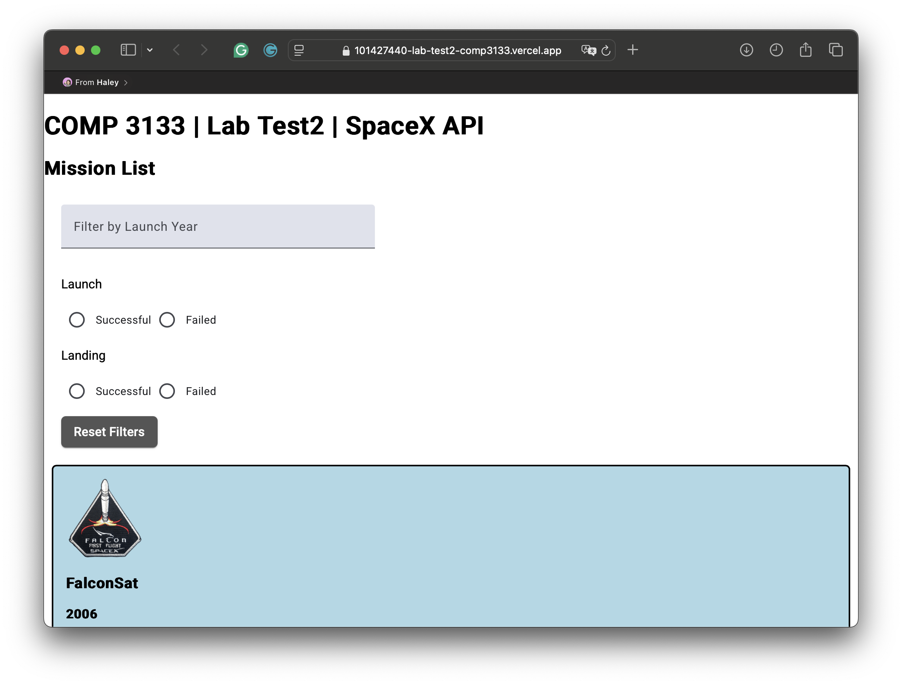
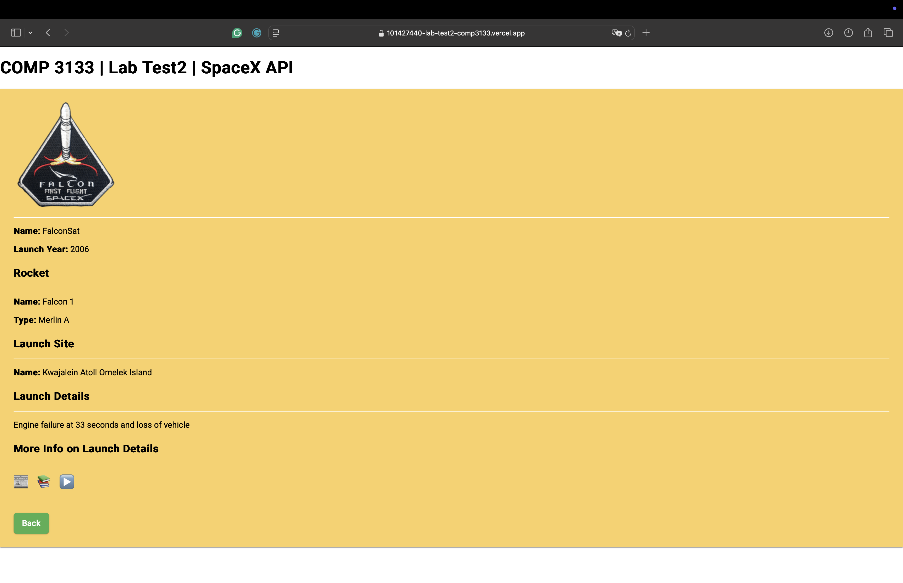

# COMP 3133 | Lab Test 2 - SpaceX Launch Viewer 🚀

This project is built with **Angular** to display and filter **SpaceX launch missions** using their public REST API. It supports dynamic filtering, detailed mission views, and responsive layout – inspired by the provided UI sample.

---

## 🔧 Technologies Used

- Angular
- TypeScript
- SpaceX Launches REST API
- Vercel (for deployment)

---

## 🚀 Features

### ✅ Mission List
- Displays mission patches, names, years, and brief details
- **Filter by:**
  - Launch year
  - Launch success
  - Landing success
- Click a mission to view full details

### ✅ Mission Details
- Image + mission metadata
- Rocket info, launch site, mission description
- External links:
  - Article 📰
  - Wikipedia 📚
  - Video ▶️

---

## 🌐 Live Demo

[🔗 View on Vercel](https://comp3133-lab-test2-spacex.vercel.app)

---

## 📦 Setup & Run Locally

```bash
git clone https://github.com/your-username/101427440-lab-test2-comp3133.git
cd 101427440-lab-test2-comp3133
npm install
ng serve
```

Navigate to `http://localhost:4200`

---

## 🛠️ Author & Info

- **Name**: Haley Kim (101427440)
- **Course**: COMP 3133 – Full Stack Development
- **Lab Test 2 – Winter 2025**

---

## 📌 Screenshots

### 🖼️ Mission List


### 🖼️ Mission Details
